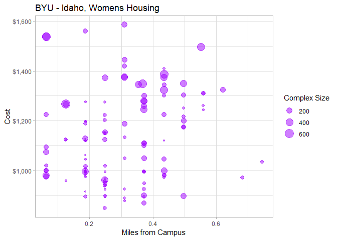

<br />

## Background
Stephanie[^1] is a student that will be starting school at BYU-Idaho next semester. Here is a copy of the email request for information that she sent.

"Hi. My name is Stephanie. I would like to learn about what housing options I have for living at BYU-Idaho next semester. It will be my first semester there, so I would like to find something that is close to campus and around $300 a month in rent. I'm not too picky on roomates, but I would like somewhere that has a lot of people around so I can get to know as many people as possible. Thanks in advance!"


**My Response:**

Hello Stephanie,

I've compiled a list of approved housing for women from the [BYU-Idaho Housing Website](https://web.byui.edu/tis/search). This first table provides all results:

```r
womens <- subset(Rent, Gender=="F")
datatable(womens, extensions="Responsive", options=list(lengthMenu = c(3,10,30,57)))
```

<!--html_preserve--><div id="htmlwidget-78664c65e0e95d180ca5" style="width:100%;height:auto;" class="datatables html-widget"></div>
<script type="application/json" data-for="htmlwidget-78664c65e0e95d180ca5">{"x":{"filter":"none","extensions":["Responsive"],"data":[["1","4","5","6","7","10","14","19","20","21","22","23","24","25","26","32","33","35","36","39","41","43","45","48","50","51","53","54","57","60","63","66","68","72","73","74","76","80","82","83","86","88","89","91","92","99","101","104","105","106","109","111","113","115","117","118","122"],["ABBY LANE MANOR","ABRI APARTMENTS - WOMEN","ALBION APARTMENT","ALEXANDER APARTMENT","ALLDREDGE HOUSE ","ALLEN'S SUNRISE VILLAGE - WOMEN","AMERICAN AVENUE - WOMEN","ASPEN VILLAGE - WOMEN","AT THE GROVE","AUTUMN WINDS","AVONLEA APARTMENTS","BAYSIDE MANOR","BIRCH PLAZA","BIRCH WOOD I","BIRCH WOOD II","BRIGHTON APARTMENTS-WOMEN","BROOKLYN APARTMENTS","BROOKSIDE VILLAGE - WOMEN","BUENA VISTA","CAMDEN APARTMENTS-WOMEN","CARRIAGE HOUSE","CEDARS, THE-WOMEN","CENTRE SQUARE-WOMEN","COLLEGE AVENUE APARTMENTS","COLONIAL HOUSE","CONDIE COTTAGE","COTTONWOOD-WOMEN","CREEKSIDE COTTAGES - WOMEN","CRESTWOOD COTTAGE","DAVENPORT APARTMENTS","GATES, THE - WOMEN","GREENBRIER SOUTH","HEMMING HOUSE I","HERITAGE WOMEN","HILLCREST TOWNHOUSES","HILL'S COLLEGE AVE APTS","IVY, THE - Women","KENSINGTON MANOR - WOMEN","LA JOLLA - WOMEN","LEGACY RIDGE","MOUNTAIN LOFTS - WOMEN","NAUVOO HOUSE II","NORMANDY APARTMENTS","NORTHPOINT - WOMEN","PARK VIEW APTS - WOMEN","RED BRICK HOUSE","RIVIERA APARTMENTS","ROOST, THE - WOMEN","ROYAL CREST","SHADETREE APARTMENT","SNOWVIEW APARTMENTS","SOMERSET APARTMENTS - WOMEN","SUNSET HALL","TOWERS II","TUSCANY PLACE - WOMEN","WEBSTER HOUSE","WINDSOR MANOR-WOMEN"],[1035,1445,1062.5,972.5,1045,1000,1050,900,null,1345,1222,960,980,1019,1275,1300,870,1310,925,1216.666666,1075,1495,1349,995,1245,1120,950,1261.666666,940,895,1375,981,1120,1259,1125,880,1267.5,1224,1129,1374,1388,1279,995,1537.333333,1050,1126,null,1175,995,915,1125,1110,967,1400,1302.5,1125,1585],[1060,1495,1150,1115,1095,1075,1075,1000,null,1345,1369,960,980,1019,1390,1325,895,1310,925,1250,1075,1495,1399,995,1245,1120,950,1395,940,895,1425,981,1150,1259,1245,880,1330,1249,1129,1399,1557,1279,995,1669,1100,1227,null,1200,995,950,1200,1110,967,1450,1315,1215,1585],[42,150,5,22,8,144,165,210,6,96,60,8,343,65,24,60,144,86,21,53,234,444,546,9,342,6,84,24,10,71,324,92,9,192,140,11,636,108,234,288,590,338,40,548,32,5,100,114,342,6,64,180,14,248,142,9,208],[0.745647284,0.310686368,0.186411821,0.434960916,0.186411821,0.062137274,0.372823642,0.372823642,0.186411821,0.434960916,0.248549095,0.124274547,0.062137274,0.062137274,0.248549095,0.434960916,0.372823642,0.559235463,0.310686368,0.497098189,0.062137274,0.553021736,0.366609915,0.248549095,0.372823642,0.434960916,0.248549095,0.559235463,0.248549095,0.186411821,0.310686368,0.434960916,0.186411821,0.372823642,0.248549095,0.310686368,0.124274547,0.062137274,0.186411821,0.248549095,0.434960916,0.372823642,0.186411821,0.062137274,0.310686368,0.186411821,0.186411821,0.497098189,0.186411821,0.186411821,0.124274547,0.372823642,0.248549095,null,0.497098189,0.124274547,0.310686368],[16,8,4,8,5,1,7,6,3,9,5,3,1,1,5,10,7,12,6,11,2,1,1,5,8,8,5,11,6,4,7,9,4,7,4,6,3,1,4,6,9,9,3,1,7,4,4,12,4,4,2,7,4,null,9,2,6],[38,216,4,18,8,133,0,84,5,96,54,8,160,160,160,60,0,96,7,65,85,230,200,10,241,5,100,28,10,30,0,70,6,145,60,3,100,103,200,288,0,300,20,508,0,5,0,35,0,0,35,80,0,248,0,14,100],[100,150,100,100,150,100,100,75,0,75,150,90,75,75,75,150,75,75,75,75,125,100,75,100,85,100,75,100,75,0,100,125,100,150,100,70,100,100,150,150,100,0,75,100,0,125,0,75,75,0,100,75,125,75,125,125,75],[0,0,0,0,0,0,0,0,0,0,0,0,0,0,0,0,0,0,0,0,0,0,0,0,0,0,0,0,0,0,0,0,0,0,0,0,0,0,0,0,0,0,0,0,0,0,0,0,0,175,0,0,0,0,0,0,0],[3,3,3,10,3,3,6,10,1,1,3,1,1,1,3,3,3,3,6,6,1,1,12,1,1,1,1,6,3,3,3,1,3,1,3,1,3,3,1,3,21,1,3,34,10,3,3,10,3,3,3,1,3,3,3,6,8],["F","F","F","F","F","F","F","F","F","F","F","F","F","F","F","F","F","F","F","F","F","F","F","F","F","F","F","F","F","F","F","F","F","F","F","F","F","F","F","F","F","F","F","F","F","F","F","F","F","F","F","F","F","F","F","F","F"],[43.8169418,43.8239342,43.8218385,43.8197811,43.82073,43.82186,43.8228628,43.814649,43.8185731,43.8156171,43.8197584,43.8203851,43.8209717,43.8209717,43.820673,43.8133921,43.8188718,43.8161353,43.8175075,43.8156024,43.8207848,43.8211586,43.811831,43.8226754,43.8176902,43.819536,43.8250778,43.8197851,43.8213116,43.819765,43.81355,43.823056,43.823583,43.8177064,43.8163212,43.822994,43.812377,43.8187924,43.8246842,43.812168,43.815,43.8155931,43.8197996,43.822758,43.8222826,43.8197965,43.8200969,43.815739,43.8191657,43.823957,43.821957,43.8163422,43.820059,null,43.8170624,43.820268,43.822092],[-111.7952062,-111.7773062,-111.7906463,-111.7918951,-111.780478,-111.785197,-111.7807632,-111.778083,-111.7766137,-111.7884885,-111.788829,-111.7795297,-111.7867163,-111.7867163,-111.7895151,-111.7945301,-111.7895166,-111.7924099,-111.7752093,-111.7917058,-111.7867195,-111.7867132,-111.787004,-111.7824172,-111.788803,-111.791806,-111.7867042,-111.7943981,-111.7809272,-111.7879773,-111.791355,-111.779371,-111.787926,-111.7881413,-111.7780659,-111.782747,-111.789553,-111.7780591,-111.7866669,-111.778051,-111.791299,-111.7888627,-111.7871315,-111.78617,-111.7924522,-111.7875345,-111.7809297,-111.792608,-111.7869267,-111.7855467,-111.784145,-111.7869059,-111.788248,null,-111.7895741,-111.7868774,-111.78069],["437 S 4TH W","220 E 1ST S","231 W 2ND S","276 W 3RD S","243 S 1ST E ","48 W 2ND S ","151 S 1ST E","545 S 2ND E","349 HARVARD AVE","160 W 5TH S","175 W 3RD S","248 1/2 CORNELL AVE","236 S 1ST W","253 S 2ND W","253 S 2ND W","242 W 6TH S ","345 S 2ND W","487 S 3RD W","406 S 3RD E","225 W 5TH S","246 S 1ST W","226 S 1st W","650 S 1ST W","150 COLLEGE AVE","151 W 4TH S","267 W 3RD S","42 S 1ST W","276 STEINER AVE","221 S 1ST E","145 W 3RD S","350 W 7TH S","129 PRINCETON CT","133 W 1ST S","129 W 4TH S","465 S 2ND E","136 COLLEGE AVE","649 S 2ND W","345 S 2ND E","65 S 1ST W","667 S 2ND E","538 S 2ND W","175 W 5TH S","114 W 3RD S","141 S 1ST W","154 S 3RD W","128 W 3RD S","277 S 1ST E","486 S 3RD W","340 S 1ST W","60 W 1ST S","12 W. 2nd S.","480 S 1ST W","150 W 3RD S","335 W 5TH S","440 S 2ND W","268 S 1ST W","125 E 2ND S"],["(208) 359-3687","(208) 417-7223","(801) 856-0732","208-995-8543","208-206-4697","208-356-3995","(208) 356-5097","(208) 356-7701","801-319-4334","(208) 356-0821","(208) 359-0920","7202574493","(208) 359-8200","(208) 359-8200","(208) 359-8200","208-356-9693","208-356-9500","(208) 356-0788","208-359-9681","208-656-9611","208-356-4361","208-346-7006","208-496-9220","208-313-8182","208-359-2848","(208) 557-1520","(208) 356-9576","(503) 515-8377","208-356-5149","208-356-3216","208-356-6686","356-3001","208-356-6142","208-356-7952","356-7211","208-356-5786 or","(208) 356-6556","208.356.4473","(208) 359-1985","359-2211","208-356-5638","356-7756","208-356-7234","208-681-9542","356-3697","356-4361","3604043","208-881-6249","208-356-7778","208-709-1608","(208) 359-5517","(208) 356-7699","356-4361","208-390-3706","(208) 356-3480","356-4361","208-356-6789"],["www.abbylaneapartments.com","www.liveabri.com","","www.alexanderapartments.wordpress.com","","www.sunrisevillageapts.com","myamericanavenue.com","www.aspenvillageapartments.com","https://www.facebook.com/atthegroveapts/","www.rexburghousing.com","www.bestnesthousing.com/avonlea.php","baysidemanor.blogspot.com","www.rexburghousing.com","www.rexburghousing.com","www.rexburghousing.com","www.brighton-apartments.net","WWW.BROOKLYNAPTS.NET","www.rexburghousing.com","buenavistarexburg.blogspot.com","www.camdenapts.net","www.bestnesthousing.com/carriage-house.php","Cedarshousing.com","www.byui.edu/housing/centre-square","","www.colonial-house.com","condiecottage.weebly.com","www.cottonwoodstudentapartments.com","creeksidewomenbyui.blogspot.com","www.crestwoodapt.com","davenportapartments.net","www.thegatesatrexburg.com","www.bestnesthousing.com","www.hemminghousing.com","HeritageRexburg.com","hillcrestinrexburg.com","","theivyapartments.com","www.kensingtonmanorrexburg.com","www.LaJollaRexburg.com","www.meet-me-at-the-ridge.com","www.mountainloftsatrexburg.com","WWW.NAUVOOHOUSE.COM","www.normandystudentapartments.com","www.NorthPointRexburg.com","www.parkviewrexburg.com","www.bestnesthousing.com/red-brick-house.php","WWW.RIVIERA-APTS.COM","rexburgroost.com","WWW.ROYALCRESTAPARTMENTS.COM","","www.snowviewapts.com","www.rexburghousing.com","www.bestnesthousing.com/sunset-hall.php","thetowerstwo.com","Tuscanyplace.net","www.bestnesthousing.com/webster-house.php","www.windsormanor.net"],["We are a small women's complex offering private rooms and quaint living.  Many students enjoy our advantages enough that they stay with us until graduation.  We are sure you would like staying with us!  We offer free parking, off-track storage and wireless internet- NOW with cheaper rent prices!","$100 OFF SPECIAL! Look no further than the Abri, Rexburg's newest student housing community. Currently leasing women's spots for fall '17, &amp; men's for winter '18. From upscale, modern finishes, to our state-of-the-art fitness center, to our courtyard with firepit, Abri is the place to be! We offer both standard &amp; townhome style residences.","Cute, newly painted basement apartment across the street from Porter Park and 1.5 blocks from the Hart building. Utilities and Internet are free. Washer and Dryer included in the Apartment. There are a total of 3 bedrooms;1 private room and 2 shared rooms. The apartment is shared by 5 girls. Call soon, our rooms go fast. Thank you for your interest. \n","We are also signing for Fall and Winter 2017. Get $25 off per semester for signing 2 consecutive semesters. No application fee or parking fee and get $40 in quarters for laundry each semester.","Hurry quick! Come make ALLDREDGE HOUSE your home away from home! Located directly across the street from the Clarke and Kirkham Buildings and only a few blocks away from down town. Great ward with the guys right next door!"," We offer housing for both men and women! We are well-known for our friendliness, new modern remodel, low prices, great location, our fantastically reliable OPTIX internet and amazing managers. You'll love having all Sunrise residents in your ward!  Now offering Unlimited Laundry each semester for $25!  We would love to have live with us and find out why everyone loves to live at Sunrise Village. ","American Avenue, BYU Idaho Approved Men and Women's housing, is less than a 1/2 block from campus. We have ample parking, FREE onsite laundry, Fiber Optix highspeed internet, 32\" flat screen SONY TV's, heated wood floors, and various layouts. We would love for you to come take a tour!\n\nBring a friend and get $100 per friend that you bring. Unlimited friend credits!","Great management. Price. Location. Pool. Semester after semester, students tell us this is why they love and remain at Aspen Village! Located across from campus and the temple we offer great views, FREE parking, NEW ping pong tables and a brand new MOVIE THEATER in our huge lounge!","At The Grove is a spacious basement apartment, located just a stone's throw away from the east side of campus, and around the corner from the temple.\nHere you will enjoy the feeling of \"home,\" with onsite *free* laundry, great managers, a great ward, and a large backyard. You'll feel right at home here at At The Grove!","Autumn Winds offers Private rooms with only 4 people per apartment! There are two bathrooms in each apartment and 4 sinks, so you will only share a bathroom with one other person, and have your own vanity area. We have plenty of parking, a nice lounge, a fantastic ward, and a long list of Rexburg Housing amenities. Space at Autumn Winds goes quickly, so reserve your spot today!","Avonlea prides itself in being one of the most sought-after complexes in Rexburg. Avonlea Apartments features beautiful grounds, a convenient location, private and shared rooms, a free washer and dryer in each apartment, free parking, and a homey feel. Visit our website, www.bestnesthousing.com for a virtual tour or stop by during office hours. ","With its prime location close to the girls dorms and across the street from campus, you can get the off-campus experience and great location all at the same time. Bayside Manor is a basement apartment that houses 8 girls. It has 3 large bedrooms, 2 bathrooms, 2 refrigerators, study room, storage room, laundry room, fireplace, internet, cable t.v., yard, &amp; lots of space! Call today 720-257-4493","Some girls choose to spend all of their BYU-Idaho years living at Birch Plaza. That's how good it is. The wards are outstanding, and there's a sense of community that you'll find almost nowhere else. Birch Plaza has an onsite professional full-service salon, a hot tub, an exercise room, and a spacious lounge. It's also right across the street from the BYU Idaho stadium! You'll love it here.","Birchwood I is a very special place. The ward is outstanding, as are the residents. There's a hot tub, an onsite full-service professional salon, and ample parking. A city park is one block away, and BYUI campus is half a block in the other direction. We've got girls from across the country and around the globe, including many returned missionaries. You're going to love Birchwood I!","Extra large PRIVATE rooms, with some shared rooms as well. Washer and dryer inside your apartment! Across the street from campus. With the BEST student ward! Hurry and sign up, because these very limited spots always fill up early. You're going to LOVE Birchwood II!","Come see our girls townhouses! Built the summer of 2012 and 2016. Only 4 girls to a townhouse! 2 Large and roomy bedrooms upstairs. Washer and dryer in each townhouse. Club house with a pool table, ping pong, air hockey table, kitchen, fireplace and a large flat screen.\n\nNO hidden fees! Discounts available, FREE parking, laundry, Optix internet and utilities!\n\nYou will love it at Brighton!","Brooklyn Apartments is a wonderful place to live, study, meet new friends and grow. Living here makes socializing, getting to class and shopping easier as we are located in the heart of Rexburg and only one block from campus. Our new furniture and carpet offers quality and comfortable living at a great low price. Come by and check us out!","Brookside Village is a unique community of private bedroom town homes. We offer a large party kitchen and dining area.  The bedrooms have built in dresser and shelves in the closet. Storage rooms are in the apartment, so you don't have to go very far to leave your items on your off track. This is the perfect place if you are looking for privacy and a social lifestyle all mixed into one! ","Buena Vista is a friendly house located near campus and the temple. We are approved housing for BYU-Idaho. There is a piano in every apartment, and a laundry room within the house. Sign a year contract (fall, winter, and spring) and get the summer free. We hope to see you at Buena Vista!","Camden Apartments has spacious PRIVATE BEDROOMS in a great location, only one block away from campus. We offer wireless internet, cable, and great payment plans. We also offer a free membership with World Gym. The free Walmart Shuttle stops right in front of our complex. To sign up for a contract, call or apply online today! 208-656-9611 www.camdenapts.net","Free washer/dryer in every apt! $50 RM and military discounts. $50 discount for returning tenants. No limit on our discounts! 100% refundable security deposit. Utilities included. No application fees. Across the street from BYUI. Captain beds in all bedrooms. High speed internet. Fast and reliable maintenance.  ","Welcome to one of the newest housing complexes in Rexburg! We are accepting tenants for Winter 2018. We are a complex with 75 apartments that have three bedroom shared units. In each unit there are 3 bathrooms, two fridges, and in apartment laundry. \n Activities will always include young men from our neighboring Mens Cedars complex across the street! Come check out a new and fun complex!\n","If you want to live in Zion, this is the place. We listened to your needs/wants and here they are. Extra storage, large kitchen &amp; pantry, wonderful vanities, free washer &amp; dryer in each apartment, study rooms, gathering rooms, music rooms, green space, etc. Come enjoy.","Cute House with Porch, Picnic Table and Barbecue Grill. Half block from the Spori Building! Plenty of parking . Two Full kitchens and Two Full Bathrooms. Vanity Areas with Sinks. Washer and Dryer in Apartment.  Close to town and BYUI!  Large porch that opens up to BYUI Play Yards. New carpet   Off-Track-Storage! Fun House !!!","\"The Mom Away From Home\" Complex.\n\nFREE Laundry (Washer &amp; Dryer in each apartment) FREE WIFI Internet, FREE Utilities, FREE Storage \"Just Like Home\".\n\nThe Colonial House is a wonderful place to live and meet new friends with a friendly, homey atmosphere with great wards and a sense of community. Visit our web site to take our online tour and secure your housing needs www.colonial-house.com","Spacious House. Plenty of room to spread out. Lots of storage space, loft in the garage and yard. Laundry room, includes free laundry, high speed internet, cable TV. Close to campus. ","Men and Women's Housing. super social, NEWLY RENOVATED and Free Laundry!\nPerfect for working students, great mix of all college ages.\nBeautiful courtyard, fruit trees, basketball court and fire pit. We also have a covered bike area. Lounge and Game room for you to enjoy!\nLess than 2 blocks from campus and close to Broulims' groceries and downtown Rexburg. \nLOTS OF PARKING TOO!\n","Three beautiful, private, remodeled, clean, BYU-I Women's houses. Located 2 1/2 blocks west of the Hart building. Each house includes: FREE washer/dryers, WiFi, cable TV, free NetFlix, Blu-Ray DVD players, 52\" LED TVs, microwaves, dishwashers, all are fully furnished. Rent includes utilities, storage and FREE parking. RM &amp; MULTI-CONTRACT DISCOUNTS!. YEAR ROUND LIVING! COME CHECK US OUT!\n","Crestwood is an affordable, great place to live! We offer free onsite laundry facilities and fiber optic high speed internet! Our tenants are awesome and our location can't be beat!","Davenport has an ideal price and an ideal location. 1/2 block from campus. FREE LAUNDRY. Recently upgraded DEPENDABLE and FAST Fiber Optic Internet.  We are well-known for our large living spaces, home-like atmosphere, fun and social wards and our WONDERFUL tenants!A great place for R.M.s!\n\nDiscounts for Fall 2017 semester:\nRM discount of $20.00\n$20 discount for rent paid IN FULL before 8-8-17","The Gates is a top-of-the-line affordable complex.  Recently built, it features some of the largest rooms in Rexburg with personal closets and separate bathrooms for each bedroom.  We have 2 fridges, TV, and a washer &amp; dryer in each apartment!  Reserve our 12 couch theater room and work out in our new weight room.  Youêll save hundreds on laundry, utilities and parking. Call us today!!","Great location! We have a wonderful management team that works together with a maintenance crew, cleaning specialist, and on-site management. We really care about what is important to the students at BYU-Idaho. \nSome of our offered amenities are coin-less washers and dryers in every apartment, cable, and internet (Qwest/Century Link). Please visit our website www.bestnesthousing.com.","Very nice house with a main floor and basement. Landscaped back yard.","Early bird price is as much as $70 off so don't wait, plus we fill fast! Hands down best location across the street from campus and the BYU-Idaho Center. Newly renovated with new appliances, cabinetry and a washer &amp; dryer.  At Heritage youêll find very affordable pricing, a huge clubhouse with a full kitchen, a piano room, WiFI internet, and 2 fitness rooms featuring state of the art equipment.","Hillcrest is a GREAT place to live! The townhouse style apartments make you feel as if you are right at home. We are newly remodeled and have private and shared rooms. All townhouses occupy only four tenants to each townhouse making plenty of room for all! Come in and take a tour! We would love to have you.  ","If you are looking for a social house, this is the one! Hills Apt. feels like you are living at home. There is a fireplace, spacious living room, huge dining room, roomy kitchen with two ovens and two fridges, with plenty of storage space and then some. There are two bathrooms, a standing shower,and tub with shower. A washer and dryer is provided and free! As well as utilities! Come take a look!  ","Our 1,430 sq. feet apartments are located near campus and feature a full size washer and dryer in each apartment.  The apartments are complete with two full bathrooms, three bedrooms, and several storage areas.  Amenities include TWO FREE SHUTTLES to and from campus, large fitness center with dance and aerobic floor, two large lounges with kitchens and several study rooms.","Make yourself at home at the Kensington Manor Apartments, located across the street from campus and can be seen from the BYU-I bookstore. Choose from three different layouts including our new, larger apartments.\n\n\"I would pick living at Kensington Manor over any other apartment complex! Wonderful Manager, terrific location, nice rooms and the best ward on campus!” _Susie            ","La Jolla is a mixed gender complex conveniently located one block north of campus.  It is close to campus, grocery stores, job opportunities on main street Rexburg, and is right next to Little Caesars Pizza!  Youêll find an outdoor BBQ grill, clubhouse, fiber optic internet, and state of the art fitness equipment.","College is about students defining their future. We want to create a living environment that empowers student to do just that. We want to provide a framework for your future. *ALL PRIVATE BEDROOMS* All inclusive: Free laundry IN THE APARTMENTS(for select apartments only, first come first serve),parking, cable, internet, DVR, flat screen TV. Fitness center, hot tub, BBQ &amp; more. BEST view in town!  ","Designed with you in mind, we have up to 6 different floor plans to choose from, with a bathroom for each bedroom, a 5 level parking garage connecting every floor, memory foam mattresses, a washer and dryer in every apartment, and the latest internet with an Optix router for each apartment. https://vimeo.com/155579284","Nauvoo House is a mixed gender complex right next to campus.  At Nauvoo House, you can find the best fitness rooms, clubhouse, basketball court, fiber optic internet, outdoor park and pavilion, BBQ grills and outdoor gas campfire!  \n\nSummer contracts only available to Spring 2017 and Fall 2017 current tenants.","Friendly, caring, and delightful students and managers. Very well maintained complex directly across from the Hart Building (Fitness Center) on campus. Basic living at its' best!\n\n\n\n\n\n\n\n\n","Sign today for $200 off spring 2018 semester!\n\nExperience the finest men's housing in Rexburg.  Located directly across from campus with modern, comfortable apartments and amazing amenities.  Sign up on our website or come in for a tour. ","Directly across the street from beautiful Porter Park and only two blocks away from campus.  Park View Apartments offers walking distance access for students, while maintaining a home environment feeling.  We offer many different floor plans with a washer and dryer in each unit.  With a great ward, unique settup and fun outdoor space a few steps away, come see if this is the place for you!","You will feel right at home in Redbrick House! The home has been converted to house 5 women; two rooms are shared, one is private. Each bedroom has a dresser, closet, sink, and vanity. The apartment is also furnished with a washer, dryer, and dishwasher. Stop by the Carriage House Apartments office for a tour, or visit our website for photos and a video tour.","Ask about our refer-a-friend/group discounts! We also have first time,RM, and New Freshmen Discounts.  Check our Website for Discounts. With our friendly homey atmosphere we're your perfect 'home away from home'. So close to campus, we're almost part of it. We're just steps away from the heart of campus. You can quickly walk anywhere. No hassle finding parking. Come be a part of Riviera!!!","It's time for a fresh start!  Opening Spring of 2017  Call 208-881-6249 for more information.  Spots won't last long, so call today!","If you are looking for affordable, comfortable, social living then Royal Crest is the place for you this semester. With our convenient location in Rexburg, you can be sure to be close to all the community and BYU-Idaho activities. With a serene and casual setting, you`re sure to feel at home with us. \n","Very large living room and kitchen, lots of room for parties and guests! One of the most affordable complexes in Rexburg. Walking distance to campus, dining, and entertainment. Washer and Dryer in the House, Optix Internet, ","Our location is unbeatable! Just a crosswalk away from the heart of campus and walking distance from a grocery store, movie theater, and fun restaurants.These town homes house 4 ladies (That means more fridge space than a 6-person apartment!) and the bedrooms and bathroom are upstairs completely separate from the large living area. SnowView offers free laundry and fresh remodels!","Somerset is located directly across the street from the heart of campus. These apartments had a major renovation completed in Fall 2015 for women.  The wards are fantastic and is all contained within Somerset. It is an experience you will love! We have a piano room, weight room, and large lounge where you can spend time with your friends.  Spaces fill up quickly-reserve your spot today!","You will feel right at home in Sunset Hall! The remodeled home has been converted to house 14 women (6 upstairs, 8 downstairs). Each floor is furnished with a washer, dryer, and dishwasher. Stop by the Carriage House Apartments office for a tour, or visit our website for photos and a video tour.","Towers Two is the newest premier women's housing at BYUI. Built with you in mind-there is nothing more that you will need! Assigned underground parking,the safety of enclosed hallways,a theater room,a gym,several lounges-providing lots to do! Inside each unit you have the luxury of a washer/dryer,2 fridges,spacious living room,&amp; huge bedrooms. Schedule a tour today to see the beauty for yourself!","Private Bedrooms - In floor heating - Window AC Units - Free Laundry -Plenty of parking- Free Tanning Beds - Exercise Room - Music Room - 1 block from BYU-I Conference Center - 2 blocks from Manwaring Center - You will love Tuscany - your home away from home....","Converted to house 9 women in 2 separate apartments, the home has 2 kitchens, 2 living rooms, and multiple bathrooms and vanities. Amenities include free washer/dryer, and dishwasher in each kitchen. \n\nWe offer A/C units in the Spring semester. A/C units are in limited supply; call/email for info on availability and rates.\n","Best location!  Across from the Kirkham Auditorium!  Awesome amenities - Gas Fire Pit, 3 BBQ's, Theater Room, Dining Room, Balconies, 3 conference rooms, 11 private study rooms, common area living rooms, gas fireplaces, a GYM and more! Each bedroom has it's own bathroom, each Apt. has 2 refrigerators, a washer/dryer, vacuum, ironing board and iron, USB ports &amp; light switch by your bed!  Come see!!"]],"container":"<table class=\"display\">\n  <thead>\n    <tr>\n      <th> <\/th>\n      <th>Apartment<\/th>\n      <th>Cost<\/th>\n      <th>CostHigh<\/th>\n      <th>Residents<\/th>\n      <th>Miles2Campus<\/th>\n      <th>WalkMinutes<\/th>\n      <th>ParkingStalls<\/th>\n      <th>Deposit<\/th>\n      <th>UtilityDeposit<\/th>\n      <th>FloorPlans<\/th>\n      <th>Gender<\/th>\n      <th>Latitude<\/th>\n      <th>Longitude<\/th>\n      <th>Address<\/th>\n      <th>Phone<\/th>\n      <th>Website<\/th>\n      <th>Description<\/th>\n    <\/tr>\n  <\/thead>\n<\/table>","options":{"lengthMenu":[3,10,30,57],"columnDefs":[{"className":"dt-right","targets":[2,3,4,5,6,7,8,9,10,12,13]},{"orderable":false,"targets":0}],"order":[],"autoWidth":false,"orderClasses":false,"responsive":true}},"evals":[],"jsHooks":[]}</script><!--/html_preserve-->

The table supplied will allow you to sort the options if you click on the arrows.

Tip: Clicking "Miles2Campus"" once, and then "Cost" once will sort both low to high with cost being the first preference.

The "Miles2Campus" and suggested walking distances will give you an idea but are not all accurate.

Click the "+" buttons to view more details. It is useful to check the addresses on a map.

## Analysis
This graph shows the relationship between the prices and proximity to campus. The dots are also colored according to the number of residents.

```r
#colorfade <- colorRampPalette(c("red", "green", "blue"))
#plot(Cost ~ Miles2Campus, data=Rent, col=colorfade(Rent$Residents))

ggplot(Rent, aes(y = Cost, x = Miles2Campus, size = Residents)) + theme_light() + geom_point(color = "#9f00FF", alpha = 0.5) +
  labs(x = "Miles from Campus", title = "BYU - Idaho, Womens Housing", size = "Complex Size") + scale_y_continuous(labels = scales::dollar)# + scale_colour_gradient2("Residents", low = "#00FFBB", mid = "#0000FF", high = "#BB00FF", midpoint = 200)
```

<!-- -->

Since you said that you were looking to pay \$300 a month, I reduced this new list to only the ones which are equivalent to $362 a month or less. I also removed any sites with a capacity of fewer than 30 residents.

```r
costwm <- subset(Rent, Gender=="F" & Cost<=1068.52 & Residents>=30)
datatable(costwm, extensions="Responsive", options=list(lengthMenu = c(5,13)))
```

<!--html_preserve--><div id="htmlwidget-3947f3ccc3fed683dc3a" style="width:100%;height:auto;" class="datatables html-widget"></div>
<script type="application/json" data-for="htmlwidget-3947f3ccc3fed683dc3a">{"x":{"filter":"none","extensions":["Responsive"],"data":[["1","10","14","19","24","25","33","53","60","66","89","92","105"],["ABBY LANE MANOR","ALLEN'S SUNRISE VILLAGE - WOMEN","AMERICAN AVENUE - WOMEN","ASPEN VILLAGE - WOMEN","BIRCH PLAZA","BIRCH WOOD I","BROOKLYN APARTMENTS","COTTONWOOD-WOMEN","DAVENPORT APARTMENTS","GREENBRIER SOUTH","NORMANDY APARTMENTS","PARK VIEW APTS - WOMEN","ROYAL CREST"],[1035,1000,1050,900,980,1019,870,950,895,981,995,1050,995],[1060,1075,1075,1000,980,1019,895,950,895,981,995,1100,995],[42,144,165,210,343,65,144,84,71,92,40,32,342],[0.745647284,0.062137274,0.372823642,0.372823642,0.062137274,0.062137274,0.372823642,0.248549095,0.186411821,0.434960916,0.186411821,0.310686368,0.186411821],[16,1,7,6,1,1,7,5,4,9,3,7,4],[38,133,0,84,160,160,0,100,30,70,20,0,0],[100,100,100,75,75,75,75,75,0,125,75,0,75],[0,0,0,0,0,0,0,0,0,0,0,0,0],[3,3,6,10,1,1,3,1,3,1,3,10,3],["F","F","F","F","F","F","F","F","F","F","F","F","F"],[43.8169418,43.82186,43.8228628,43.814649,43.8209717,43.8209717,43.8188718,43.8250778,43.819765,43.823056,43.8197996,43.8222826,43.8191657],[-111.7952062,-111.785197,-111.7807632,-111.778083,-111.7867163,-111.7867163,-111.7895166,-111.7867042,-111.7879773,-111.779371,-111.7871315,-111.7924522,-111.7869267],["437 S 4TH W","48 W 2ND S ","151 S 1ST E","545 S 2ND E","236 S 1ST W","253 S 2ND W","345 S 2ND W","42 S 1ST W","145 W 3RD S","129 PRINCETON CT","114 W 3RD S","154 S 3RD W","340 S 1ST W"],["(208) 359-3687","208-356-3995","(208) 356-5097","(208) 356-7701","(208) 359-8200","(208) 359-8200","208-356-9500","(208) 356-9576","208-356-3216","356-3001","208-356-7234","356-3697","208-356-7778"],["www.abbylaneapartments.com","www.sunrisevillageapts.com","myamericanavenue.com","www.aspenvillageapartments.com","www.rexburghousing.com","www.rexburghousing.com","WWW.BROOKLYNAPTS.NET","www.cottonwoodstudentapartments.com","davenportapartments.net","www.bestnesthousing.com","www.normandystudentapartments.com","www.parkviewrexburg.com","WWW.ROYALCRESTAPARTMENTS.COM"],["We are a small women's complex offering private rooms and quaint living.  Many students enjoy our advantages enough that they stay with us until graduation.  We are sure you would like staying with us!  We offer free parking, off-track storage and wireless internet- NOW with cheaper rent prices!"," We offer housing for both men and women! We are well-known for our friendliness, new modern remodel, low prices, great location, our fantastically reliable OPTIX internet and amazing managers. You'll love having all Sunrise residents in your ward!  Now offering Unlimited Laundry each semester for $25!  We would love to have live with us and find out why everyone loves to live at Sunrise Village. ","American Avenue, BYU Idaho Approved Men and Women's housing, is less than a 1/2 block from campus. We have ample parking, FREE onsite laundry, Fiber Optix highspeed internet, 32\" flat screen SONY TV's, heated wood floors, and various layouts. We would love for you to come take a tour!\n\nBring a friend and get $100 per friend that you bring. Unlimited friend credits!","Great management. Price. Location. Pool. Semester after semester, students tell us this is why they love and remain at Aspen Village! Located across from campus and the temple we offer great views, FREE parking, NEW ping pong tables and a brand new MOVIE THEATER in our huge lounge!","Some girls choose to spend all of their BYU-Idaho years living at Birch Plaza. That's how good it is. The wards are outstanding, and there's a sense of community that you'll find almost nowhere else. Birch Plaza has an onsite professional full-service salon, a hot tub, an exercise room, and a spacious lounge. It's also right across the street from the BYU Idaho stadium! You'll love it here.","Birchwood I is a very special place. The ward is outstanding, as are the residents. There's a hot tub, an onsite full-service professional salon, and ample parking. A city park is one block away, and BYUI campus is half a block in the other direction. We've got girls from across the country and around the globe, including many returned missionaries. You're going to love Birchwood I!","Brooklyn Apartments is a wonderful place to live, study, meet new friends and grow. Living here makes socializing, getting to class and shopping easier as we are located in the heart of Rexburg and only one block from campus. Our new furniture and carpet offers quality and comfortable living at a great low price. Come by and check us out!","Men and Women's Housing. super social, NEWLY RENOVATED and Free Laundry!\nPerfect for working students, great mix of all college ages.\nBeautiful courtyard, fruit trees, basketball court and fire pit. We also have a covered bike area. Lounge and Game room for you to enjoy!\nLess than 2 blocks from campus and close to Broulims' groceries and downtown Rexburg. \nLOTS OF PARKING TOO!\n","Davenport has an ideal price and an ideal location. 1/2 block from campus. FREE LAUNDRY. Recently upgraded DEPENDABLE and FAST Fiber Optic Internet.  We are well-known for our large living spaces, home-like atmosphere, fun and social wards and our WONDERFUL tenants!A great place for R.M.s!\n\nDiscounts for Fall 2017 semester:\nRM discount of $20.00\n$20 discount for rent paid IN FULL before 8-8-17","Great location! We have a wonderful management team that works together with a maintenance crew, cleaning specialist, and on-site management. We really care about what is important to the students at BYU-Idaho. \nSome of our offered amenities are coin-less washers and dryers in every apartment, cable, and internet (Qwest/Century Link). Please visit our website www.bestnesthousing.com.","Friendly, caring, and delightful students and managers. Very well maintained complex directly across from the Hart Building (Fitness Center) on campus. Basic living at its' best!\n\n\n\n\n\n\n\n\n","Directly across the street from beautiful Porter Park and only two blocks away from campus.  Park View Apartments offers walking distance access for students, while maintaining a home environment feeling.  We offer many different floor plans with a washer and dryer in each unit.  With a great ward, unique settup and fun outdoor space a few steps away, come see if this is the place for you!","If you are looking for affordable, comfortable, social living then Royal Crest is the place for you this semester. With our convenient location in Rexburg, you can be sure to be close to all the community and BYU-Idaho activities. With a serene and casual setting, you`re sure to feel at home with us. \n"]],"container":"<table class=\"display\">\n  <thead>\n    <tr>\n      <th> <\/th>\n      <th>Apartment<\/th>\n      <th>Cost<\/th>\n      <th>CostHigh<\/th>\n      <th>Residents<\/th>\n      <th>Miles2Campus<\/th>\n      <th>WalkMinutes<\/th>\n      <th>ParkingStalls<\/th>\n      <th>Deposit<\/th>\n      <th>UtilityDeposit<\/th>\n      <th>FloorPlans<\/th>\n      <th>Gender<\/th>\n      <th>Latitude<\/th>\n      <th>Longitude<\/th>\n      <th>Address<\/th>\n      <th>Phone<\/th>\n      <th>Website<\/th>\n      <th>Description<\/th>\n    <\/tr>\n  <\/thead>\n<\/table>","options":{"lengthMenu":[5,13],"columnDefs":[{"className":"dt-right","targets":[2,3,4,5,6,7,8,9,10,12,13]},{"orderable":false,"targets":0}],"order":[],"autoWidth":false,"orderClasses":false,"responsive":true}},"evals":[],"jsHooks":[]}</script><!--/html_preserve-->


## Interpretation

Any of the apartments may be worth your consideration. Birch Plaza is a popular choice. You might also consider Brookyln or Davenport for their price. The more expensice ones have some nice features, like Birch Wood I with its hot tub! 

[^1]: Note that Stephanie is a fictional character who is based on real experiences of many faculty and staff here at BYU-Idaho.
