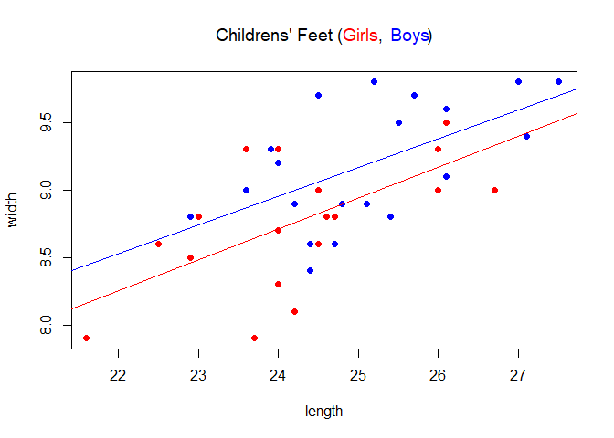
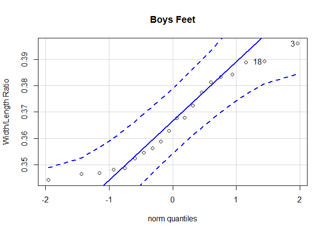
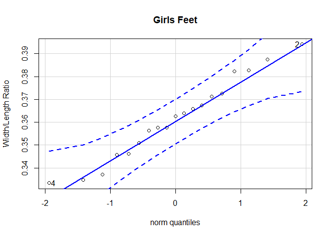
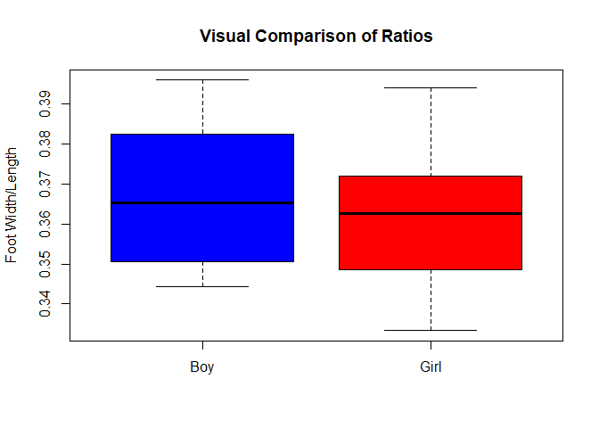

---
title: "Kids Feet t Test"
output: 
  html_document:
    theme: spacelab
    code_folding: hide
    keep_md: true
---


<script type="text/javascript">
 function showhide(id) {
    var e = document.getElementById(id);
    e.style.display = (e.style.display == 'block') ? 'none' : 'block';
 }
</script>
<!-- Instructions

1. Use the KidsFeet dataset in R to come up with a question that can be answered with a t Test (One Sample, Paired Samples, or Independent Samples).

2. Establish why the question is interesting. State the question in written form as well as with a statistical "null" and "alternative" hypothesis.

3. Clearly answer your question using statistics. Be sure to compute a p-value and provide supporting numerical and graphical summaries. Also be sure to establish whether or not the requirements of your t test have been satisfied. (See the Math 325 Notebook for details.)

-->
## Background

The library Mosaic includes the "KidsFeet" dataset. It comes from a study interested in comparing the foot widths of boys and girls in the 4th grade.

While exploring this data I became interested in the width/length ratio of the feet. I decided to focus on the difference between the shapes of the feet between the girls and boys.

This turns out to be the same thing that Mary Meyer was analysing in 1997. She wanted to challenge the claim that boys feet are wider, when her daughter was limited to narrower shoes. (See the R Documentation and reference)

Originally, I wanted to see if there was a difference between foot shapes for the genders, but the general belief seems to already be that boys feet are wider. So I will let that be the null hypothesis and conduct the test to see if boys feet are not relatively wider:

$$
  H_0: \mu_{\text{width/lenth of boys' feet}} - \mu_{\text{width/length of girls' feet}} > 0
$$
$$
  H_a: \mu_{\text{width/lenth of boys' feet}} - \mu_{\text{width/length of girls' feet}} \le 0
$$
This table shows the full dataset:

```r
datatable(KidsFeet, options=list(lengthMenu =c(5,10,39)))
```

<!--html_preserve--><div id="htmlwidget-9a65f3215a63bcccfb62" style="width:100%;height:auto;" class="datatables html-widget"></div>
<script type="application/json" data-for="htmlwidget-9a65f3215a63bcccfb62">{"x":{"filter":"none","data":[["1","2","3","4","5","6","7","8","9","10","11","12","13","14","15","16","17","18","19","20","21","22","23","24","25","26","27","28","29","30","31","32","33","34","35","36","37","38","39"],["David","Lars","Zach","Josh","Lang","Scotty","Edward","Caitlin","Eleanor","Damon","Mark","Ray","Cal","Cam","Julie","Kate","Caroline","Maggie","Lee","Heather","Andy","Josh","Laura","Erica","Peggy","Glen","Abby","David","Mike","Dwayne","Danielle","Caitlin","Leigh","Dylan","Peter","Hannah","Teshanna","Hayley","Alisha"],[5,10,12,1,2,3,2,6,5,9,9,3,8,3,11,4,12,3,6,3,6,7,9,9,10,7,2,12,11,8,6,7,3,4,4,3,3,1,9],[88,87,87,88,88,88,88,88,88,88,87,88,87,88,87,88,87,88,88,88,88,88,88,88,88,88,88,87,88,88,88,88,88,88,88,88,88,88,88],[24.4,25.4,24.5,25.2,25.1,25.7,26.1,23,23.6,22.9,27.5,24.8,26.1,27,26,23.7,24,24.7,26.7,25.5,24,24.4,24,24.5,24.2,27.1,26.1,25.5,24.2,23.9,24,22.5,24.5,23.6,24.7,22.9,26,21.6,24.6],[8.4,8.8,9.7,9.8,8.9,9.7,9.6,8.8,9.3,8.8,9.8,8.9,9.1,9.8,9.3,7.9,8.7,8.8,9,9.5,9.2,8.6,8.3,9,8.1,9.4,9.5,9.5,8.9,9.3,9.3,8.6,8.6,9,8.6,8.5,9,7.9,8.8],["B","B","B","B","B","B","B","G","G","B","B","B","B","B","G","G","G","G","G","G","B","B","G","G","G","B","G","B","B","B","G","G","G","B","B","G","G","G","G"],["L","L","R","L","L","R","L","L","R","R","R","L","L","L","L","R","R","R","L","R","R","L","R","L","L","L","L","R","L","R","L","R","L","R","R","L","L","R","L"],["R","L","R","R","R","R","R","R","R","L","R","R","R","R","R","R","L","R","L","R","R","R","L","R","R","R","R","R","R","L","R","R","R","L","L","R","R","R","R"]],"container":"<table class=\"display\">\n  <thead>\n    <tr>\n      <th> <\/th>\n      <th>name<\/th>\n      <th>birthmonth<\/th>\n      <th>birthyear<\/th>\n      <th>length<\/th>\n      <th>width<\/th>\n      <th>sex<\/th>\n      <th>biggerfoot<\/th>\n      <th>domhand<\/th>\n    <\/tr>\n  <\/thead>\n<\/table>","options":{"lengthMenu":[5,10,39],"columnDefs":[{"className":"dt-right","targets":[2,3,4,5]},{"orderable":false,"targets":0}],"order":[],"autoWidth":false,"orderClasses":false}},"evals":[],"jsHooks":[]}</script><!--/html_preserve-->

## Analysis
From the scatterplot below it appears that the regression lines (correlation between width and length) for boys and girls are about paralell to each other:

```r
plot(width ~ length, data=subset(KidsFeet, sex=="G"), pch=16,col="red", ylim = c(7.9, 9.8), xlim = c(21.65, 27.5))
title(expression("Childrens' Feet (" * phantom("Girls") * "," *phantom(" Boys") * ")"), col.main = "black")
title(expression(phantom("Childrens' Feet (Girls, ") * "Boys"), col.main = "blue")
title(expression(phantom("Childrens' Feet (") * "Girls" * phantom(", Boys)")), col.main = "red")
points(width ~ length, data=subset(KidsFeet, sex=="B"), pch=16,col="blue")
abline(lm(width ~ length, data=subset(KidsFeet, sex=="B")), col="blue")
abline(lm(width ~ length, data=subset(KidsFeet, sex=="G")), col="red")
```

<!-- -->
</br >
It isn't appropriate to make a certain inference just by looking at this graph, so I will run a mathematical test on the data.
</br >
This analysis is focused on comparing the ratios of the widths and lengths of feet between boys and girls.
</br >
To check for normality I created a Q-Q plot for each sex, Boy and Girl:

```r
boyfeet <- subset(KidsFeet, sex=="B")
girlfeet <- subset(KidsFeet, sex=="G")
library(car)
library(mosaic)
qqPlot(boyfeet$width/boyfeet$length, ylab="Width/Length Ratio", main="Boys Feet")
```

<!-- -->

```
## [1]  3 18
```

```r
qqPlot(girlfeet$width/girlfeet$length, ylab="Width/Length Ratio", main="Girls Feet")
```

<!-- -->

```
## [1] 2 4
```
</br >
The sample is normally distributed for both boys and girls. This means I can confidently conduct a t test. I choose to use a 0.05 level of significance. The results are summarized below:

```r
pander(t.test(width/length ~ sex, data=KidsFeet, alternative="less"))
```


-----------------------------------------------------------------------------
 Test statistic    df     P value   Alternative hypothesis   mean in group B 
---------------- ------- --------- ------------------------ -----------------
     0.8792       36.56   0.8075             less                0.3664      
-----------------------------------------------------------------------------

Table: Welch Two Sample t-test: `width/length` by `sex` (continued below)

 
-----------------
 mean in group G 
-----------------
     0.3616      
-----------------
<center>
#### Box Plot and Statistical Summary
</center>


```r
KidsFeet$gender <- revalue(KidsFeet$sex, c("B"="Boy", "G"="Girl"))
boxplot(width/length ~ gender, data=KidsFeet, col=c("blue","red"), main="Visual Comparison of Ratios", ylab="Foot Width/Length")
```

<!-- -->


```r
pander(favstats(width/length ~ gender, data=KidsFeet))
```


---------------------------------------------------------------------------------------
 gender    min       Q1     median     Q3      max      mean      sd      n    missing 
-------- -------- -------- -------- -------- -------- -------- --------- ---- ---------
  Boy     0.3443   0.3515   0.3654   0.3819   0.3959   0.3664   0.01671   20      0    

  Girl    0.3333   0.3486   0.3625   0.3719   0.3941   0.3616   0.0177    19      0    
---------------------------------------------------------------------------------------

# Interpretation
The P-value for this test is 0.8075, which does not give me a reason to reject the notion that boys feet are proportionally wider than girls feet. It is worth noting that this particular sample represents boys with a slightly wider average foot than girls. With a larger sample, I could tell with more certainty. It would also be important to collect a more random sample as this was just a convenience sample from one 4th grade class.
