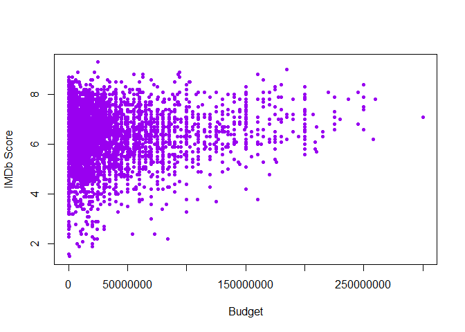
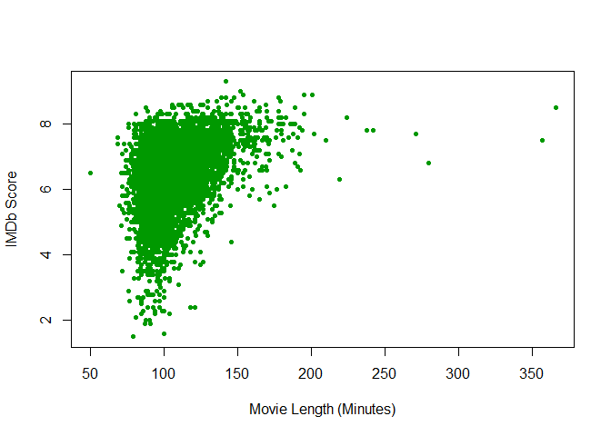
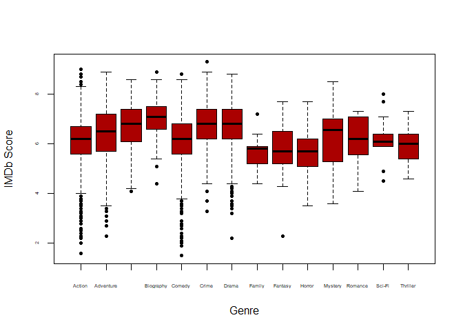
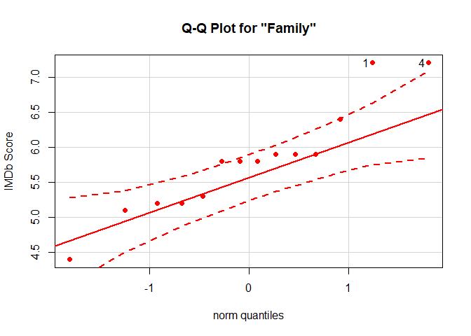
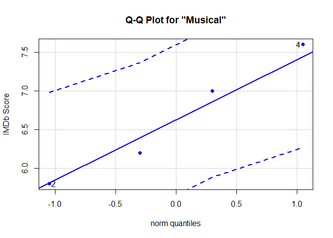
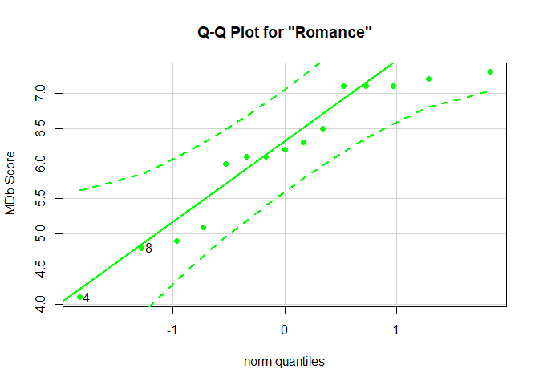
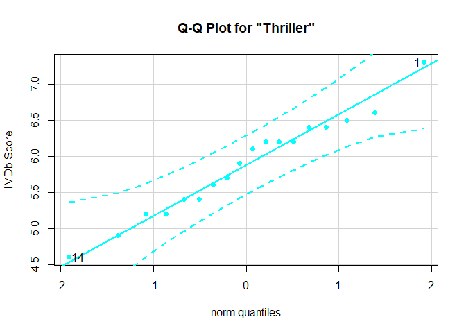
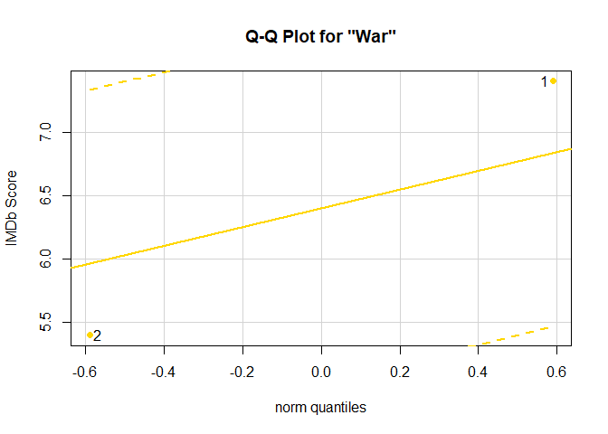
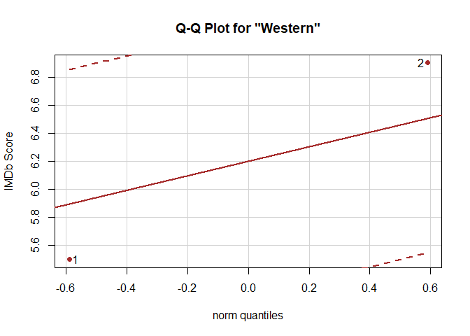

<script type="text/javascript">
 function showhide(id) {
    var e = document.getElementById(id);
    e.style.display = (e.style.display == 'block') ? 'none' : 'block';
 }
</script>


<br />

# Question

Throughout the world, thousands of movies are produced every year.<sup>[1](#References)</sup> As a producer it is imporant to consider what types of movies are prone to produce a higher revenue. <br />
Observed in this analysis are box office films from January 1986 to Novebmer 2017. It is not a complete census, but a large sample, with 6,820 entries.<sup>[2](#References)</sup>

# Analysis

There are several variables we could look at. We'll observe the budget, the film length, and the genre.

<!-- Instructions: Come up with an interesting question and answer it with the "movies" dataset that is provided above. 

Write a Background that gives meaning to your question of interest.

State your Question.

Perform an appropriate "Analysis" that gives useful information for answering your question. The hope would be a really powerful graphic and some summary tables of supporting statistics.

Interpret your analysis and expound on your findings. -->

### Budget

It seems likely that a movie with a high budget would also be "good." But this is the actual distribution of budgets and ratings:<br />
Movies received good ratings from all budget levels, however, the megaphone shape in this scatter plot shows that as the budget increases the chances of producing a terrible movie tend to become much smaller.
<!-- -->
<br />The movie with the largest budget in this dataset was *Pirates of the Caribbean: At World's End* (2007) at  \$300,000,000 with a rating of 7.1, while *The Dark Knight* (2008) was budgeted at \$185,000,000 and earned a rating of 9.0. The highest rated movie in the set was *The Shawshank Redemption* (1994) at 9.3. It's budget was only $25,000,000.

### Movie Length

This was an interesting variable to look at. The average movie is 106.5 minutes. This trend is somewhat similar to the budget-score trend and generally speaking, the longer films seem to generate respect. This influence is a bit stonger than budget.
<!-- -->
<br />These are the longest movies in the set:

```
## Warning in instance$preRenderHook(instance): It seems your data is too
## big for client-side DataTables. You may consider server-side processing:
## https://rstudio.github.io/DT/server.html
```

<!--html_preserve--><div id="htmlwidget-ea4076185f665683c5e0" style="width:100%;height:auto;" class="datatables html-widget"></div>
<script type="application/json" data-for="htmlwidget-ea4076185f665683c5e0">{"x":{"filter":"none","data":[["396","1191","1196","1352","1588","2249","3393","3454","3744","3871","3891"],[0,23000000,0,33000000,25000000,18000000,6000000,0,94000000,56000000,0],["Sands","Argos Films","Pierre Grise Productions","Largo International N.V.","TriStar Television","Castle Rock Entertainment","Aamir Khan Productions","Dharma Productions","New Line Cinema","Turner Pictures (I)","BiBi Film"],["UK","Germany","France","USA","USA","UK","India","India","USA","USA","Italy"],["Christine Edzard","Wim Wenders","Jacques Rivette","Spike Lee","Ron Maxwell","Kenneth Branagh","Ashutosh Gowariker","Karan Johar","Peter Jackson","Ron Maxwell","Marco Tullio Giordana"],["Drama","Action","Drama","Biography","Drama","Drama","Adventure","Drama","Adventure","Biography","Drama"],[1025228,752856,408571,48169908,10769960,4414535,70147,2902000,377845905,12870569,254224],["Little Dorrit","Until the End of the World","La bella latosa","Malcolm X","Gettysburg","Hamlet","Lagaan: Once Upon a Time in India","Kabhi Khushi Kabhie Gham...","The Lord of the Rings: The Return of the King","Gods and Generals","The Best of Youth"],["G","R","UNRATED","PG-13","PG","PG-13","PG","Not specified","PG-13","PG-13","R"],["1988-10-21","1991-12-25","1991-09-04","1992-11-18","1993-10-08","1996-12-25","2002-05-08","2001-12-14","2003-12-17","2003-02-21","2003-06-20"],[357,280,238,202,271,242,224,210,201,219,366],[7.5,6.8,7.8,7.7,7.7,7.8,8.2,7.5,8.9,6.3,8.5],["Derek Jacobi","William Hurt","Michel Piccoli","Denzel Washington","Tom Berenger","Kenneth Branagh","Aamir Khan","Shah Rukh Khan","Elijah Wood","Stephen Lang","Luigi Lo Cascio"],[886,7344,5123,69074,22949,32078,82703,34762,1332020,13829,17585],["Charles Dickens","Peter Carey","Pascal Bonitzer","Alex Haley","Michael Shaara","William Shakespeare","Ashutosh Gowariker","Karan Johar","J.R.R. Tolkien","Jeff Shaara","Sandro Petraglia"],[1987,1991,1991,1992,1993,1996,2001,2001,2003,2003,2003]],"container":"<table class=\"display\">\n  <thead>\n    <tr>\n      <th> <\/th>\n      <th>budget<\/th>\n      <th>company<\/th>\n      <th>country<\/th>\n      <th>director<\/th>\n      <th>genre<\/th>\n      <th>gross<\/th>\n      <th>name<\/th>\n      <th>rating<\/th>\n      <th>released<\/th>\n      <th>runtime<\/th>\n      <th>score<\/th>\n      <th>star<\/th>\n      <th>votes<\/th>\n      <th>writer<\/th>\n      <th>year<\/th>\n    <\/tr>\n  <\/thead>\n<\/table>","options":{"lengthMenu":[3,11],"columnDefs":[{"className":"dt-right","targets":[1,6,10,11,13,15]},{"orderable":false,"targets":0}],"order":[],"autoWidth":false,"orderClasses":false}},"evals":[],"jsHooks":[]}</script><!--/html_preserve-->
As would be expected, the foreign companies have a tendency to be more adventurous.<br />
The fact that the last two plots have a similar shape suggests that there might be a correlation between budget and runtime. Indeed there is, but it isn't strong nor is it linear. Infact, while there is an overall positive linear correlation of 0.268, the very longest films actually have the smallest bugdets.

### Genre

The final variable we wanted to consider was the genre.
<div style="padding-left:15px;">
##### <a href="javascript:showhide('2')">Click for details</a>
<div id="2" style="display:none;">

---------------------------------------------------------------------------------
   genre     min    Q1     median    Q3    max   mean      sd      n     missing 
----------- ----- ------- -------- ------ ----- ------- -------- ------ ---------
  Action     1.6    5.6     6.2     6.7     9    6.106   1.021    1331      0    

 Adventure   2.3    5.7     6.5     7.2    8.9   6.355   1.114    392       0    

 Animation   4.1    6.1     6.8     7.4    8.6   6.747   0.9271   277       0    

 Biography   4.4    6.6     7.1     7.5    8.9   7.04    0.6367   359       0    

  Comedy     1.5    5.6     6.2     6.8    8.8   6.166   0.9825   2080      0    

   Crime     3.3    6.2     6.8     7.4    9.3   6.756   0.861    522       0    

   Drama     2.2    6.2     6.8     7.4    8.8   6.716   0.8741   1444      0    

  Family     4.4   5.225    5.8     5.9    7.2   5.793   0.7711    14       0    

  Fantasy    2.3   5.25     5.7     6.5    7.7   5.775   1.068     32       0    

  Horror     3.5    5.1     5.7     6.2    7.7   5.687   0.8614   277       0    

  Musical    5.8    6.1     6.6     7.15   7.6   6.65    0.8062    4        0    

  Mystery    3.6    5.4     6.55     7     8.5   6.342   1.102     38       0    

  Romance    4.1   5.55     6.2     7.1    7.3   6.127   0.9996    15       0    

  Sci-Fi     4.5    5.9     6.1     6.4     8    6.254   0.9649    13       0    

 Thriller    4.6    5.4      6      6.35   7.3   5.878   0.6822    18       0    

    War      5.4    5.9     6.4     6.9    7.4    6.4    1.414     2        0    

  Western    5.5   5.85     6.2     6.55   6.9    6.2    0.9899    2        0    
---------------------------------------------------------------------------------
</div>
</div>
<!-- -->
<font size="1.5"><br />
"Musical," "War," and "Western" each had less than 5 occurances and were not displayed in this plot to save space, but they closely resemble the other genres with respect to IMDb score.
<br />
</font>
<br />
An appropriate null hypothesis for the genres is that the mean IMDb scores are all equal. So the alternative hypothesis is that at least one genre has a different mean score:
$$
  H_0: α1=α2=…=0
$$
$$
  H_a: αi≠0 \text{ for at least one i}
$$
We'll use a one-way ANOVA to see if it is statistically significant (Choosing 0.95 for the confidence level). "Family" and Sci-Fi" are not normally distributed, so they were removed from the analysis:

```r
movies2.aov <- aov(score ~ genre, data=subset(movies2, genre!="Sci-Fi" & genre!="Family"))
pander(summary(movies2.aov))
```


----------------------------------------------------------------
    &nbsp;        Df    Sum Sq   Mean Sq   F value     Pr(>F)   
--------------- ------ -------- --------- --------- ------------
   **genre**      14    776.7     55.48     62.04    1.634e-165 

 **Residuals**   6778    6061    0.8943      NA          NA     
----------------------------------------------------------------

Table: Analysis of Variance Model


We can reject the null hypothesis.<br />

<div style="padding-left:15px;">
##### <a href="javascript:showhide('name')">Details on the requirements</a>
<div id="name" style="display:none;">
The genre with the highest variance in score is Adventure (1.2409483) and the genre with the lowest is Biography (0.4054311). We will not run into any problems with the variances being too far apart.

This table shows the sample size from each genre:

------------------------------------------------------------------------------
 Action   Adventure   Animation   Biography   Comedy   Crime   Drama   Family 
-------- ----------- ----------- ----------- -------- ------- ------- --------
  1331       392         277         359       2080     522    1444      14   
------------------------------------------------------------------------------

Table: Table continues below

 
------------------------------------------------------------------------------------
 Fantasy   Horror   Musical   Mystery   Romance   Sci-Fi   Thriller   War   Western 
--------- -------- --------- --------- --------- -------- ---------- ----- ---------
   32       277        4        38        15        13        18       2       2    
------------------------------------------------------------------------------------
For the genres with at least 30 samples, I assumed the central limit theorem.
I tested the genres with less samples for normality individually:<br />
<!-- -->

```
## [1] 1 4
```

<!-- -->

```
## [1] 4 2
```

<!-- -->

```
## [1] 4 8
```

<!-- -->

```
## [1] 3 9
```

<!-- -->

```
## [1]  1 14
```

<!-- -->

```
## [1] 2 1
```

<!-- -->

```
## [1] 1 2
```
<br />"Family" and Sci-Fi" are not normally distributed, so they were removed them from the ANOVA.

This is the result of the one-way ANOVA without removing the "Family" or "Sci-Fi" genres:

```r
movies2.aov2 <- aov(score ~ genre, data=movies2)
pander(summary(movies2.aov2))
```


----------------------------------------------------------------
    &nbsp;        Df    Sum Sq   Mean Sq   F value     Pr(>F)   
--------------- ------ -------- --------- --------- ------------
   **genre**      16    781.6     48.85     54.66    5.985e-165 

 **Residuals**   6803    6080    0.8938      NA          NA     
----------------------------------------------------------------

Table: Analysis of Variance Model
</div>
</div>

<!--"Family" is the lowest scoring genre. For the sake of curiosity, the highest rated family movies in this dataset are *Little Nemo: Adventures in Slumberland* (1989) from Japan and *Nutcracker* (1986) from the USA, both rated 7.2.<br />-->


# Interpretation

If one decided to make the movie 140 minutes or longer, and used a high enough budget to produce something of quality, they would likely make a well accepted movie.<br />
The genre was not terribly influential in previous films. One might consider producing a biographical film, but it is uncertain how well a biography would combine with an extended length.<br />
There are however, many other factors that are likely to influence the score; including the writer, director, acting, music, art, and cult followings. To make one of the best movies, such factors of quality will need to be implemented.

<br />

#### References {#References}
1. https://stephenfollows.com/how-many-films-are-made-around-the-world/

2. This analysis was created using the movies2 data provided by Brother Saunders. The dataset was too large to be reasonably displayed in this document.
