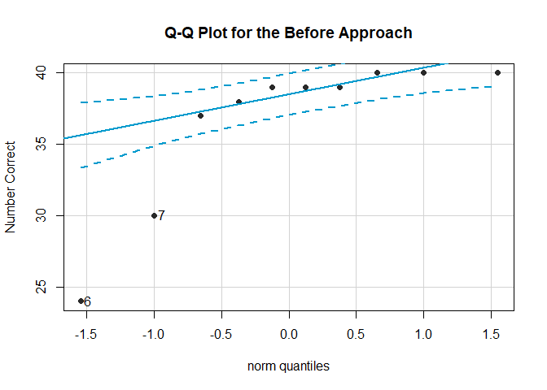
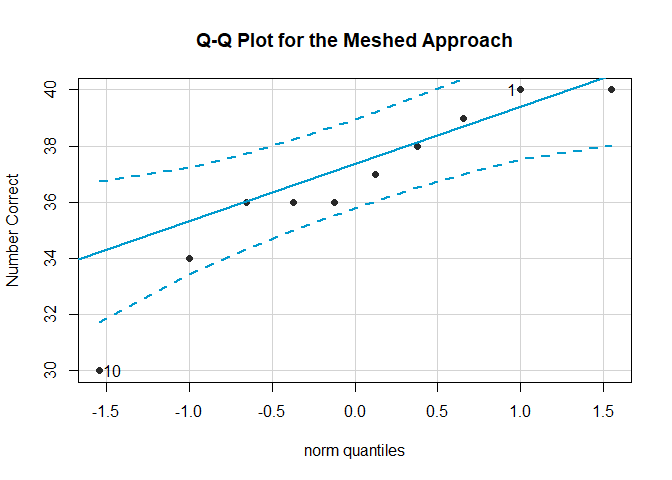
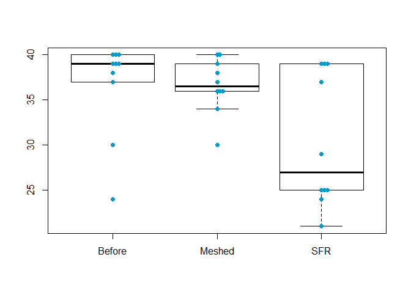

<script type="text/javascript">
 function showhide(id) {
    var e = document.getElementById(id);
    e.style.display = (e.style.display == 'block') ? 'none' : 'block';
 }
</script>


<br />

#### Background

Many teachers and other educators are interested in understanding how to best deliver new content to students. In general, they have two choices of how to do this.

1. The Meshed Approach
    * Deliver new content while simultaneously reviewing previously understood content.

2. The Before Approach
    * Deliver new content after fully reviewing previously understood content.

A study was performed to determine whether the *Meshed* or *Before* approaches to delivering content had any positive benefits on memory recall. 

<div style="padding-left:15px;">

##### <a href="javascript:showhide('uniquename')">The Experiment <span style="font-size:8pt;">(click to view)</span></a>


<div id="uniquename" style="display:none;">

Individuals were seated at a computer and shown a list of words. Words appeared on the screen one at a time, for two seconds each, until all words had been shown (40 total). After all words were shown, they were required to perform a few two-digit mathematical additions (like 15 + 25) for 15 seconds to avoid immediate memory recall of the words. They were then asked to write down as many of the 40 words as they could remember. They were given a maximum of 5.3 minutes to recall words.

The process of showing words and recalling words was repeated four times with the same list of words each time (four chances to get it right). The presentation of the first trial was the same for all treatment conditions. However, trials 2, 3, and 4 were slightly different for each treatment condition.

<div style="padding-left:15px;">

The `SFR` group (the control group) stands for Standard Free Recall. In all four trials the same list of 40 words was presented, in a random order each time.

The `Before` group also used the same 40 words during each trial. However, any words that were correctly recalled in a previous trial were presented first, or *before* the words that were not recalled in the last trial. After all the correct words were presented in random order, the non-recalled words were presented in a random order.

The `Meshed` group also used the same 40 words during each trial. However, words that were correctly recalled in a previous trial were alternated with a missed word during the next presentation order. 

</div>

The data records the number of correctly recalled words (out of the 40 possible) from the fourth trial. Results were obtained for 30 students, 10 in each of the three treatment groups: `SFR`, `Before`, and `Meshed`. 

</div>

##### <a href="javascript:showhide('uniquename2')">The Data <span style="font-size:8pt;">(click to view)</span></a>

<div id="uniquename2" style="display:none;">

<!--The results from the study can be found in the `Friendly` data set in R after loading `library(car)`. -->

Click the "Code" button to see the data.


```r
datatable(Friendly, options=list(lengthMenu = c(3,10,30)))
```

<!--html_preserve--><div id="htmlwidget-62fc95be94d6e50cfbc8" style="width:100%;height:auto;" class="datatables html-widget"></div>
<script type="application/json" data-for="htmlwidget-62fc95be94d6e50cfbc8">{"x":{"filter":"none","data":[["1","2","3","4","5","6","7","8","9","10","11","12","13","14","15","16","17","18","19","20","21","22","23","24","25","26","27","28","29","30"],["SFR","SFR","SFR","SFR","SFR","SFR","SFR","SFR","SFR","SFR","Before","Before","Before","Before","Before","Before","Before","Before","Before","Before","Meshed","Meshed","Meshed","Meshed","Meshed","Meshed","Meshed","Meshed","Meshed","Meshed"],[39,25,37,25,29,39,21,39,24,25,40,38,39,37,39,24,30,39,40,40,40,39,34,37,40,36,36,38,36,30]],"container":"<table class=\"display\">\n  <thead>\n    <tr>\n      <th> <\/th>\n      <th>condition<\/th>\n      <th>correct<\/th>\n    <\/tr>\n  <\/thead>\n<\/table>","options":{"lengthMenu":[3,10,30],"columnDefs":[{"className":"dt-right","targets":2},{"orderable":false,"targets":0}],"order":[],"autoWidth":false,"orderClasses":false}},"evals":[],"jsHooks":[]}</script><!--/html_preserve-->


</div>
</div>

<br />


<!-- Begin writing your analysis below here. -->

<!-- Note that your goal is to use the Friendly data to show whether or not the Meshed or Before methods have any positive benefit on memory recall. -->

# Analysis

For this particular analysis I am only interested in the comparing the Before and Meshed approaches:
$$
  H_0: {\text{difference in medians}} = 0
$$
$$
  H_a: {\text{difference in medians}} \ne 0
$$
There are only 10 results from each of the tests and the data is not normally distributed for the Before approach, and only partially normal for the Meshed approach.
<div style="padding-left:15px;">
##### <a href="javascript:showhide('uniquename3')">Click to view the Q-Q plots</a>
<div id="uniquename3" style="display:none;">

```r
set2 <- subset(Friendly, condition != "SFR")
set2$condition <- droplevels(set2$condition)

qqPlot(subset(Friendly, condition=="Before")$correct, ylab="Number Correct", main="Q-Q Plot for the Before Approach", col.lines="deepskyblue3", pch=16, col="gray16")
```

<!-- -->

```
## [1] 6 7
```
<center>
**Not normally distributed**
</center>


```r
qqPlot(subset(Friendly, condition=="Meshed")$correct, ylab="Number Correct", main="Q-Q Plot for the Meshed Approach", col.lines="deepskyblue3", pch=16, col="gray16")
```

<!-- -->

```
## [1] 10  1
```
<center>
**Also not normally distributed**
</center>
</br >
</div>
</div>
Because of this, using a Wilcoxon rank sum test would be a good fit.
The significance level will be set at 0.05.

```r
pander(kruskal.test(list(subset(Friendly, condition=="SFR")$correct, subset(Friendly, condition=="Before")$correct, subset(Friendly, condition=="Meshed")$correct)))
```


-------------------------------
 Test statistic   df   P value 
---------------- ---- ---------
     5.182        2    0.07496 
-------------------------------

Table: Kruskal-Wallis rank sum test: `list(subset(Friendly, condition == "SFR")$correct, subset(Friendly,     condition == "Before")$correct, subset(Friendly, condition ==     "Meshed")$correct)`

<div style="padding-left:15px;">
##### <a href="javascript:showhide('uniquename4')">Click to view a table and graphical summary of the data</a>
<div id="uniquename4" style="display:none;">

```r
pander(favstats(correct ~ condition, data=Friendly))
```


------------------------------------------------------------------------------
 condition   min    Q1     median    Q3     max   mean    sd     n    missing 
----------- ----- ------- -------- ------- ----- ------ ------- ---- ---------
  Before     24    37.25     39     39.75   40    36.6   5.337   10      0    

  Meshed     30     36      36.5    38.75   40    36.6   3.026   10      0    

    SFR      21     25       27     38.5    39    30.3   7.334   10      0    
------------------------------------------------------------------------------

```r
boxplot(correct ~ condition, data=Friendly, horizontal=F, las=0)
stripchart(correct ~ condition, data=Friendly, add=TRUE, pch=16, col="deepskyblue3", vertical=T, method="stack")
```

<!-- -->
</div>
</div>
# Interpretation
The table summary includes that the results from the Before method have a higher median score (39) than the results from the Meshed (36.5).
<br />
The p-value from the analysis however, is 0.378. This is well above 0.05, so we can not claim sufficient evidence that there is a difference in recollection between the Before and Meshed approaches.
<br />
If another experiment was conducted with more participants, then a more certain comparison could be obtained. I might suggest however, that if this research is continued, an experiment would be most valuable conducted dirrectly in the classrooms.
