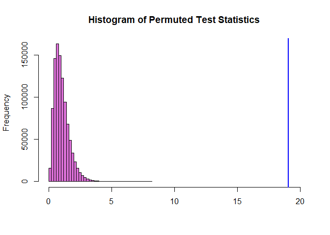
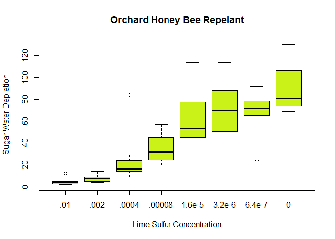

### Background

# {.tabset .tabset-fade}

## Explanation
The OrchardSprays dataset conatins the results of a test conducted in 1947. The purpose of the test was to see how well lime sulfur could prevent bees from polinating trees.
Honey comb cells were filled with a sucrose solution. Bees were given two hours to colect the solution. In 64 samples, 8 different levels of lime sulfer were added to the solutions, 8 observations per level. The amount that the solution was collected by the bees was recorded.

## Data
"decrease" is the amount of solution consumed. </br>
"treatment" is the concentration of lime sulfer as indicated: </br>
$A = \frac{1}{100}\text{    }$
$B = \frac{1}{500}\text{    }$
$C = \frac{1}{2,500}\text{    }$
$D = \frac{1}{12,500}\text{    }$
$E = \frac{1}{62,500}\text{    }$
$F = \frac{1}{312,500}\text{    }$
$G = \frac{1}{1,562,500}\text{    }$
$H = 0$ </br>
The samples were arranged in a [Latin square](https://en.wikipedia.org/wiki/Latin_square).
<center>

```r
pander(OrchardSprays)
```


----------------------------------------
 decrease   rowpos   colpos   treatment 
---------- -------- -------- -----------
    57        1        1          D     

    95        2        1          E     

    8         3        1          B     

    69        4        1          H     

    92        5        1          G     

    90        6        1          F     

    15        7        1          C     

    2         8        1          A     

    84        1        2          C     

    6         2        2          B     

   127        3        2          H     

    36        4        2          D     

    51        5        2          E     

    2         6        2          A     

    69        7        2          F     

    71        8        2          G     

    87        1        3          F     

    72        2        3          H     

    5         3        3          A     

    39        4        3          E     

    22        5        3          D     

    16        6        3          C     

    72        7        3          G     

    4         8        3          B     

   130        1        4          H     

    4         2        4          A     

   114        3        4          E     

    9         4        4          C     

    20        5        4          F     

    24        6        4          G     

    10        7        4          B     

    51        8        4          D     

    43        1        5          E     

    28        2        5          D     

    60        3        5          G     

    5         4        5          A     

    17        5        5          C     

    7         6        5          B     

    81        7        5          H     

    71        8        5          F     

    12        1        6          A     

    29        2        6          C     

    44        3        6          F     

    77        4        6          G     

    4         5        6          B     

    27        6        6          D     

    47        7        6          E     

    76        8        6          H     

    8         1        7          B     

    72        2        7          G     

    13        3        7          C     

    57        4        7          F     

    4         5        7          A     

    81        6        7          H     

    20        7        7          D     

    61        8        7          E     

    80        1        8          G     

   114        2        8          F     

    39        3        8          D     

    14        4        8          B     

    86        5        8          H     

    55        6        8          E     

    3         7        8          A     

    19        8        8          C     
----------------------------------------
</center>
#

### Analysis and Interpretation

Was there a difference in the levels of sulfer?
$$
H_0: \text{There is no difference in the mean depletion of sucrose solution for each level of sulfur}
$$
$$
H_a: \text{At least one of the levels has a different mean}
$$
</br>
I have no idea if the requirements are met for an ANOVA test, but I don't care because I can use a permutation test instead.

```r
myTest <- aov(decrease ~ treatment, data = OrchardSprays)
observedTestStat <- summary(myTest)[[1]]$`F value`[1]

N <- 1000000
permutedTestStats <- rep(NA, N)
for (i in 1:N){
  permutedData <- sample(OrchardSprays$decrease)
  permutedTest <- aov(permutedData ~ treatment, data = OrchardSprays)
  permutedTestStats[i] <- summary(permutedTest)[[1]]$`F value`[1]
}
```

This distribution is the result of 1,000,000 random permutations:

```r
hist(permutedTestStats, col = "orchid", xlim = c(0,20), breaks=50, main="Histogram of Permuted Test Statistics", xlab=NA)
abline(v = observedTestStat, col = "blue", lwd = 2)
```

<!-- -->
</br>
The blue line represents the observed statistic. It is 19.0618169. Comparing to the statistic distribution of random order gives a two-sided P-value of 0. The observation is clearly significant.


```r
boxplot(decrease ~ treatment, data=OrchardSprays, main="Orchard Honey Bee Repelant", ylab="Sugar Water Depletion", xlab="Lime Sulfur Concentration", xaxt="n", col="#caf219") 
axis(1, at=1:8, labels=c(".01", ".002",".0004",".00008","1.6e-5","3.2e-6","6.4e-7","0"))
```

<!-- -->

Most levels are dramatically different from each other. A concentration of 1/2,500 (0.0004) or more works well at repelling bees, depending on how much the bees need to be repelled.

Also, we now wonder if using 1,000,000 permutations is less work than checking the ANOVA assumptions. It's okay though because my distribution is crazy accurate.
